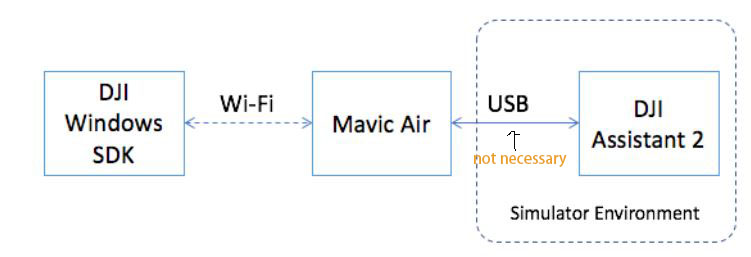

# DJI-Windows-SDK-UWP-Learning
大疆windows-sdk(alpha version)学习

---
## Prerequisite
To use DJI windows SDK:
* A PC or laptop with a Wi-Fi adapter(5GHz recommended)
* win7 or above
* vs 2017
* Mavic Air with latest firmware

## * Setup Environment
* Install DJI Assistant 2
* Prepare Mavic Air
* Change to 2.4GHz
* Connect Mavic Air to DJi Assistant 2
* Setup Summary
::

---
## Build And Run SDK Sample
There are two projects included in the solution:
* DJIWindowsSDKDemo：demonstrates the usage of SDK's interfaces
* DJIVideoParser：used to decode the video from the aircraft(FFmepg is used in the parser)

---
## error occured when building,debuging...
1. *错误 C7510 “Callback”: 模板 从属名称的使用必须以“模板”为前缀*
* C/C++ -> 语言 -> 符合模式：关闭/permissive-[取消禁用多语言扩展，本是为了适应跨平台跨编译器编译Windows C++代码做的检查，但是拦住了WRL里的Callback末班函数的调用]